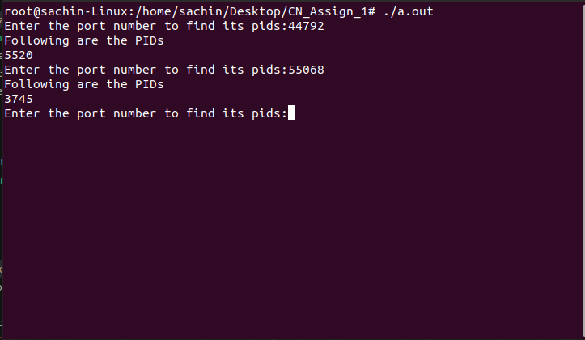

# Computer Networks Assignment 1

The following repository contains the solutions for the Assignment 1 of Computer Networks,
The Assignment can be found under the file name Assignment-1 in the repository.  

### Question 1: Execution steps

1. Open the terminal and navigate to the directory where the file is located.
2. Run the following command to compile the file:
    ```bash
    g++ problem1.cpp
    sudo ./a.out
    ```
    The code should be run in root mode as it requires the root privileges to create the raw socket.  
3. Open another terminal for tcp replay and run the following command:
    ```bash
    sudo tcpreplay -i lo --mbps=0.5 prob1.pcap
    ```
    The above command will replay the pcap file at 0.5Mbps speed. It is better to turn off internet to avoid the socket from receiving other packets.
4. The output of the program will be written in the file [logsq1.txt](logsq1.txt) in the same directory.

5. For the question of number of flows and their
4-tuple, when the program is terminated using Ctrl+C the terminal will output number of flows and their 4-tuples, the output can be large.

### Question 2: Execution steps

1. Open the terminal and navigate to the directory where the file is located.

2. Run the following command to compile the file:
    ```bash
    gcc problem2.c
    sudo ./a.out
    ```
    The code should be run in root mode as it requires the root privileges to create the raw socket.  
3. Open another terminal for tcp replay and run the following command:
    ```bash
    sudo tcpreplay -i lo --mbps=1 2.pcap
    ```
    The above command will replay the pcap file at 1Mbps speed. It is better to turn off internet to avoid the socket from receiving other packets.

4. The log file will be stored in logsq2.txt

5. Now run the following commands to search for the flags in the logs file:
    ```bash
    python3 flag_hunter.py
    ```

    The output will show the data packets containing the flags.

### Question 3: Execution steps

1. Open the terminal and navigate to the directory where the file is located.

2. Run the following command to compile the file:
    ```bash
    g++ problem3.cpp
    sudo ./a.out
    ```
    The code should be run in root mode as it requires the root privileges to create the raw socket.

3. The program will sniff packets for 30 seconds and then ask the user to enter the socket number and as an ouput the program will print the PID of the process using that socket.  

4. The logs of the program can be found in logsp3.txt and pid_data.txt, the pid_data contains the pids of the sockets extracted. The results can be verified by running the following command in the terminal:
    ```bash
    sudo ss -nap
    ```
    
